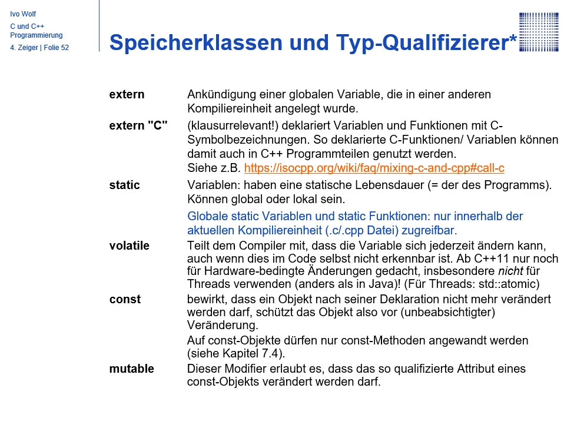

C has no class and no method, therefore all is public
in C++, the standard Modifier is private

```c++
int sth() {
    public:
}

int sth() {
    private:
}

int sth() {
    protected:
}
```

Modifications for Variable



```c++
virtual void setWeigth();
```