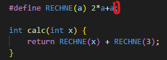

# Bit Schifter / Printer
you can shift the bits, if on the left side of the<br>
an Object/Class stands

# Variable Initialization
When you initialize a variable, C and C++, unlike Java, doesn't generate/assign automatically a neutral/0 value to it, but a random one from the Memory.

```C
int a; // (!) WRONG
int b = 0; // good
```

### Example
```c
int  globalfunction2() {
  unsigned int sth;
  printf("sth=%u\n",sth);
}
// by executing the method twice, you will get
// -> sth=513
// -> sth=4294967295
```

# Sprachumfang gering:
## Keyword in ( C )
  |   |   |   |   |  
-- | -- | -- | -- | -- | --
auto | default |  float | long | sizeof | union
break | do |  for | register | static | unsigned
case | double | goto | return | struct | void
char | else | if | short | switch | volatile
const | enum | int | signed | typedef | while
continue | extern

## Additional in ( C99 ):
  |   |   |   | 
-- | -- | -- | -- | --
inline | restrict | _Bool | _Complex | _Imaginary

… everything else strictly speaking does not belong to the language, but is itself an extension …


## Macro


semicolon will be written below as string
