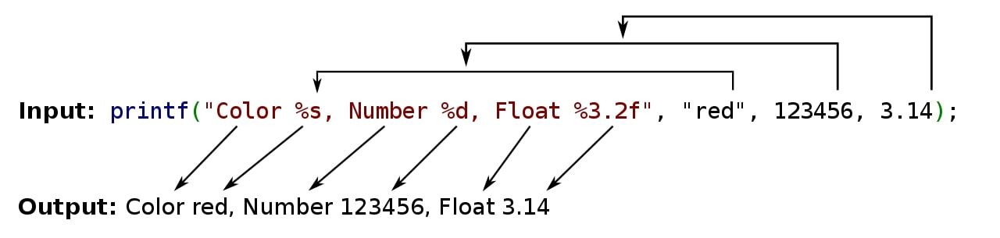

[wiki](https://en.wikipedia.org/wiki/Printf_format_string)

specifier | argument | more
:--: | -- | --
% |  | Prints a literal % character (this type doesn't accept any flags, width, precision, length fields).
d, i | Sign Int | int as a signed [integer](https://en.wikipedia.org/wiki/Integer "Integer"). %d and %i are synonymous for output, but are different when used with `[scanf](https://en.wikipedia.org/wiki/Scanf() "Scanf()")` for input (where using %i will interpret a number as hexadecimal if it's preceded by 0x, and octal if it's preceded by 0.)
u | Unsign Int | Print decimal unsigned int.
f, F |  | double in normal ([fixed-point](https://en.wikipedia.org/wiki/Fixed-point_arithmetic "Fixed-point arithmetic")) notation. f and F only differs in how the strings for an infinite number or NaN are printed (inf, infinity and nan for f; INF, INFINITY and NAN for F).
e, E | Floating Point | double value in standard form (_d_._ddd_e±_dd_). An E conversion uses the letter E (rather than e) to introduce the exponent. The exponent always contains at least two digits; if the value is zero, the exponent is 00. In Windows, the exponent contains three digits by default, e.g. 1.5e002, but this can be altered by Microsoft-specific `_set_output_format` function.
g, G | Shortest Representation | double in either normal or exponential notation, whichever is more appropriate for its magnitude. g uses lower-case letters, G uses upper-case letters. This type differs slightly from fixed-point notation in that insignificant zeroes to the right of the decimal point are not included. Also, the decimal point is not included on whole numbers.
x, X | Unsign Hex | unsigned int as a [hexadecimal](https://en.wikipedia.org/wiki/Hexadecimal "Hexadecimal") number. x uses lower-case letters and X uses upper-case.
o | Unsign Octal | unsigned int in octal.
s | String | [null-terminated string](https://en.wikipedia.org/wiki/Null-terminated_string "Null-terminated string").
c | Char | char (character).
p | Pointer Adress | void* (pointer to void) in an implementation-defined format.
a, A | Hex Floating Point | double in hexadecimal notation, starting with 0x or 0X. a uses lower-case letters, A uses upper-case letters.[[5]](https://en.wikipedia.org/wiki/Printf_format_string#cite_note-5)[[6]](https://en.wikipedia.org/wiki/Printf_format_string#cite_note-6) (C++11 iostreams have a hexfloat that works the same).
n |  | Print nothing, but writes the number of characters written so far into an integer pointer parameter.  In Java this prints a newline.[[7]](https://en.wikipedia.org/wiki/Printf_format_string#cite_note-7)

flag | description
:--: | --
`-` | Left-justify (default right)
`+` | Forse print + sign with positives 
(space) | Add space, if no sign before value
`#` | Precede o, x or X with 0
`0` | left pad number with zeros

%20TEMP/General/old/UniHSMA/Java/Print.md)